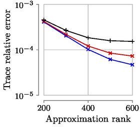
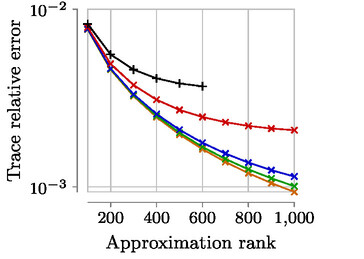
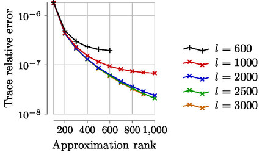
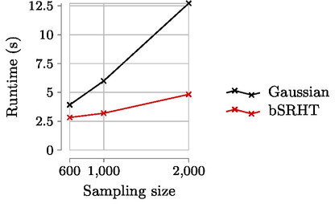
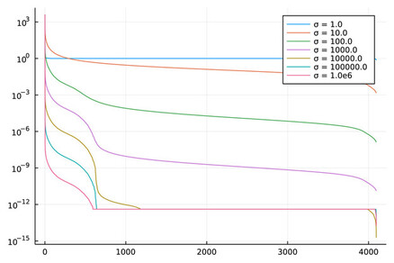

# Presentation

This code performs some of the experiments in 

> O. Balabanov, M. Beaupere, L. Grigori, V. Lederer. *Block
subsampled randomized Hadamard transform for low-rank approximation on
distributed architectures*. [View on arXiv](https://arxiv.org/abs/2210.11295).

Given a dense, large, distributed matrix $A$, we aim at computing a random sampling
of $A$ (randomized, or sketched). It is further used to computing the
Nyström low rank approximation of $A$.

Furthermore, it also serves the illustrations of my Ph.D thesis.

* Conservation of the inner product through sketching.
* Obtain singular values from several datasets.

# Instructions to reproduce the Nyström approximation experiments

Expected accuracy results (Datasets MNIST, Year with sigma=1000, Year with sigma=10 000):

    

Expected runtime results:




## Required software

The experiments were done under a Linux environment.

This program requires Julia version 1.7.2 with the following packages

* TimerOutputs.jl
* ClusterManager.jl
* DistributedArrays.jl
* Hadamard.jl.

## Obtain the dataset

Download and extract the training and test datasets.

```
$> wget https://www.csie.ntu.edu.tw/\~cjlin/libsvmtools/datasets/multiclass/mnist.scale.bz2
$> wget https://www.csie.ntu.edu.tw/\~cjlin/libsvmtools/datasets/multiclass/mnist.scale.t.bz2
$> bzip2 -d mnist.scale.bz2
$> bzip2 -d mnist.scale.t.bz2
```

Concatenate datasets, merging 60 000 records from the training data and 5536 records from the testing data.
The suffix specifying the feature count `_780` is required for the program to work correctly.

```
$> cat mnist.scale > mnist_780
$> head -n 5536 mnist.scale.t >> mnist_780
```

Or build a datasets of 32 768 rows

```
$> head -n 32768 mnist.scale >> mnist_780
```

## Execute the program

Load environment variables corresponding to the dataset.
```
$> source scripts/env/mnist.env
```

Start Julia
```
$> ./path/to/julia -p 64
```

And then start the script to reproduce the timings and the error.
```
julia> include("scripts/nystrom.jl")
```

The scripts in `scripts/env` can help to execute this on a cluster equipped with the Slurm scheduler.

## Find the results

### Timings

Look at the file `timings_p64_kmin200_height65536.csv` for the times in milliseconds. Columns are
1. The sampling parameter
2. The time of block SRHT
3. The time of TSQR
4. The time of SVD of R
5. The time of Gaussian sampling

Only (2) and (5) are given in the submitted paper.

### Error

Look at the files `nuclear_error_*.csv` to get the relative trace error of each run.

# Additional instructions

This section describes how to reproduces figures from my PhD thesis.

## Nyström approximation of additional datasets

The previous step can be reproduced with other datasets:

* [YearPredictionMSD](https://www.csie.ntu.edu.tw/~cjlin/libsvmtools/datasets/regression/YearPredictionMSD.bz2)
* [detection_of_IoT_botnet_attacks_N_BaIoT](http://archive.ics.uci.edu/ml/datasets/detection_of_IoT_botnet_attacks_N_BaIoT)
* [Physical Unclonable Functions](http://archive.ics.uci.edu/ml/datasets/Physical+Unclonable+Functions) (`xor`)

## Plot singular values for each dataset and different sigmas

Expected result for the MNIST dataset:



Use the `scripts/plot_rbs_kernel_svd.jl` file and modify the constants:

* `dataset_filename`: Path to dataset.
* `sep`: Dataset values separation character.
* `sigmas`: Different values of sigma (see RBS kernel expression), each corresponding to a line in the plot.

## Plot inner products conservation

Use the `scripts/innerproducts.jl` file. Call the `main` function with the wanted
dataset (including random) and value for $l$, the sampling size.


